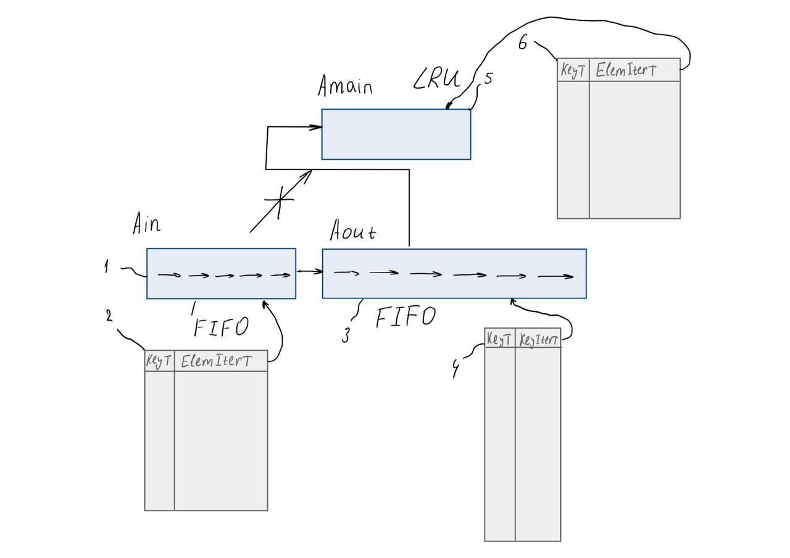
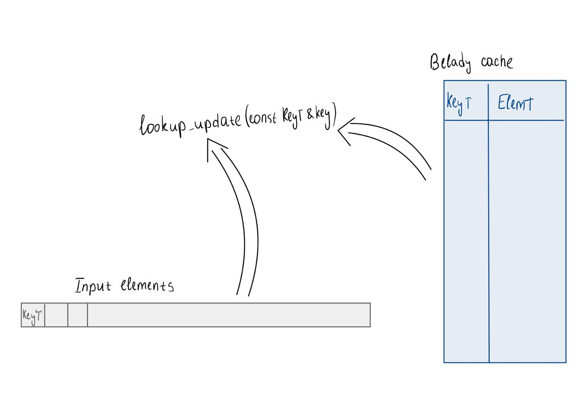

<div align="center">
  
  # Implementation of the `2Q cache` algorithm in C++ and comparison of its efficiency with the `Belady cache`
  </div>

## Content
- [1. Annotation](#annotation)
- [2. Introduction](#introduction)
- [3. Implementation of algorithms](#implementation-of-algorithms)
- [4. Results](#results)
- [5. Сonclusions](#conclusions)
- [6. Run the program](#run-the-program)

## Annotation
Implementations of the `2Q cache` and the `Belady cache` have been developed. A comparison of their efficiency revealed that the performance of the `2Q` algorithm varies significantly depending on the access pattern. And in some cases its performance was much more effective, yielding hit-rate statistics that closely approximated those of the `Belady` benchmark.

## Introduction
In industrial applications, data is frequently retrieved from remote devices or servers. This downloading process is often time-consuming and can significantly degrade overall system performance.

While one potential solution is to create faster download methods, their development is typically costly and does not always lead to substantial gains.

A more efficient approach is to implement a local data store, or `cache`, which holds frequently accessed information. The strategy used to predict which data will be needed again is managed by a caching algorithm. This program implements two such algorithms—the `2Q` and the `Belady` algorithms—and provides a comparative analysis of their effectiveness.

## Implementation of algorithms
### 2Q cache
`Ain` Queue: When a new element (not currently in the cache) is requested, it is first loaded into the `Ain` queue. This queue operates on a First-In, First-Out (`FIFO`) principle. 

`Aout` Queue: When an element is evicted from the `Ain` queue, only its key is moved into the `Aout` queue. This queue is also a `FIFO` and acts as a history of recently seen elements. 

`Amain` Queue: If a requested element's key is found in the `Aout` queue, it indicates the element was seen before and is likely needed again. In this case, the element itself is loaded into the `Amain` queue. This queue is managed by a Least Recently Used (`LRU`) policy, meaning the least recently accessed element is evicted first.

<div align="center"></div><br>
  <div align="center"> Fig 1. Implementation of 2Q cache. 1 - std::list, 2 - std::unordered_map for queue in. 3 - std::list, 4 - std::unordered_map for queue out. 5 - std::list, 6 - std::unordered_map for queue main. Ain and Aout is a FIFO queues, Amain is managed by a LRU policy.</div><br>

  Definition of class cache2q:
  ```C++
template <typename KeyT, typename ElemT>
class cache2q
{
    // constants
    using ElemListT = std::list<std::pair<KeyT, ElemT>>;
    using ElemIterT = ElemListT::iterator;
    using KeyListT  = std::list<KeyT>;
    using KeyIterT  = KeyListT::iterator;
    using FuncToGetElem = std::function<ElemT(const KeyT &)>;

    ElemListT list_in_;
    ElemListT list_main_;
    KeyListT  list_out_;

    std::unordered_map<KeyT, ElemIterT> hash_table_in_;
    std::unordered_map<KeyT, ElemIterT> hash_table_main_;
    std::unordered_map<KeyT, KeyIterT>  hash_table_out_;

    FuncToGetElem slow_get_elem_;

    // sizes of queues
public:
    // methods
};
```
Implementation of the `2Q cache` search algorithm and its updates:
<details>
<summary>Click to show/hide code</summary>

```C++
bool lookup_update (const KeyT &key)
{
    if (hash_table_in_.contains (key) )
        return true;

    auto data_from_key_main = hash_table_main_.find (key);

    if (data_from_key_main != hash_table_main_.end ())
    {
        list_main_.splice (list_main_.begin (), list_main_, data_from_key_main->second);
        data_from_key_main->second = list_main_.begin ();

        return true;
    }

    auto new_elem = slow_get_elem_ (key);

    auto data_from_key_out = hash_table_out_.find (key);

    if (data_from_key_out == hash_table_out_.end ())
        insert_to_in (key, new_elem);
    else
    {
        insert_to_main (key, new_elem);

        hash_table_out_.erase (data_from_key_out);
        list_out_.erase (data_from_key_out->second);
    }

    return false;
}
```
</details>

### Belady cache
The `Belady` algorithm, also known as the Optimal algorithm or MIN, serves as a benchmark for evaluating the performance of practical caching algorithms. Its operation is based on perfect knowledge of future requests. For every access, the algorithm knows the entire sequence of elements that will be needed afterwards. This allows it to make the optimal eviction decision: it always removes the cached element that will be used farthest in the future. Consequently, the `Belady` algorithm achieves the theoretically lowest possible cache miss rate, providing an ideal standard against which real-world algorithms are measured.

<div align="center"></div><br>
  <div align="center"> Fig 2. Implementation of Belady cache. It used one std::unordered_map as a storage facility. It also has a std::vector of elements that will be introduced in the future. </div><br>

Definition of class belady_cache:
```C++
class belady_cache
{
    using KeyVectorT  = std::vector<KeyT>;
    using FuncToGetElem = std::function<ElemT(const KeyT &)>;

    size_t size_;
    KeyVectorT  input_elements_;
    size_t      ind_elems_;
    FuncToGetElem slow_get_elem_;
    std::unordered_map<KeyT, ElemT> cache_;
public:
    // methods
};
```

Implementation of the `Belady cache` search algorithm and its updates:
<details>
<summary>Click to show/hide code</summary>

```C++
bool lookup_update (const KeyT &key)
{
    ++ind_elems_;

    if (cache_.contains (key))
        return true;

    if (cache_.size () == size_)
        erase_elem_from_belady_cache ();

    cache_.try_emplace (key, slow_get_elem_ (key));

    return false;
}
```
</details>

Implementation of the function erase_elem_from_belady_cache () you can find in [cache_belady.hpp](/include/cache_belady.hpp).

## Results

|№| Input data in the format `cache size` `number of input elements` `all input elements` | number of cache hits for `2Q` algorithm | number of cache hits for `Belady` algorithm | 
|--|--------------------------------------|----------------------|------------|
|1| 10 25 1 2 3 4 5 1 2 3 4 5 6 7 8 1 2 3 4 5 6 7 8 9 10 11 12 | 5 | 13 |
|2| 10 30 5 12 5 18 12 5 3 18 12 5 3 18 12 5 3 18 12 5 3 18 12 5 3 18 12 5 3 18 5 3 | 24 | 26 |
|3| 15 35 1 6 11 16 21 1 6 11 16 21 26 31 1 6 11 16 21 26 31 1 6 11 16 21 26 31 1 6 11 26 21 31 6 11 1 | 20 | 28 |
|4| 10 28 3 4 3 5 4 6 5 7 6 8 7 9 8 10 9 11 10 12 11 13 12 14 13 15 14 16 13 17 | 12 | 13 |
|5| 15 40 2 5 8 2 5 8 11 14 2 5 8 11 14 17 20 2 5 8 11 14 17 20 23 26 2 5 8 11 14 17 20 23 26 29 32 2 5 8 11 14 | 18 | 29 |
|6| 10 32 4 7 10 4 7 10 13 16 4 7 10 13 16 19 22 4 7 10 13 16 19 22 25 28 4 7 10 13 16 19 4 7| 10 | 23 |
|7| 20 45 1 2 3 4 5 6 7 8 9 10 11 12 13 14 15 16 17 18 19 20 1 2 3 4 5 6 7 8 9 10 11 12 13 14 15 16 17 18 19 20 21 22 23 24 25 | 0 | 20 |
|8| 15 38 3 7 12 3 7 12 17 22 3 7 12 17 22 27 32 3 7 12 17 22 27 32 37 3 7 12 17 22 27 32 37 3 7 12 17 22 27 7 3 | 21 | 30 |

## Сonclusions

Our analysis revealed that the performance of the `2Q` algorithm varies significantly depending on the access pattern.

In certain cases, such as Test 7 which used a linear access sequence, the `2Q cache` incurred a substantially higher number of misses compared to the optimal `Belady` algorithm.

However, for other patterns, notably in Tests 2 and 4, its performance was much more effective, yielding hit-rate statistics that closely approximated those of the `Belady` benchmark.

## Run the program
### Run
1) Clone the repository
```shell
git clone ...
```
2) Go to repository folder
```bash
cd 2Q_cache
```
3) Create a build folder and go to it
```bash
mkdir build && cd build
```
4) Generate a file for assembly using cmake
```bash
cmake -DCMAKE_BUILD_TYPE=RELEASE ..
```
5) Assemble the project
```bash
cmake --build .
```
6) Run the executable file of `2q cache`
```bash
./cache_2q
```
6) *Or run the executable file of imitation `belady cache`
```bash
./cache_belady
```
6) **Or run `tests`
```bash
./cache_2q_tests
./cache_belady_tests
```
### Project structure
```tree
2Q_cache/
├── CMakeLists.txt
├── include
│   ├── cache_2q.hpp
│   ├── cache_belady.hpp
├── src
│   ├── main_2q.cpp
│   └── main_belady.cpp
└── tests
    ├── cache_2q_tests.cpp
    └── cache_belady_tests.cpp
```
